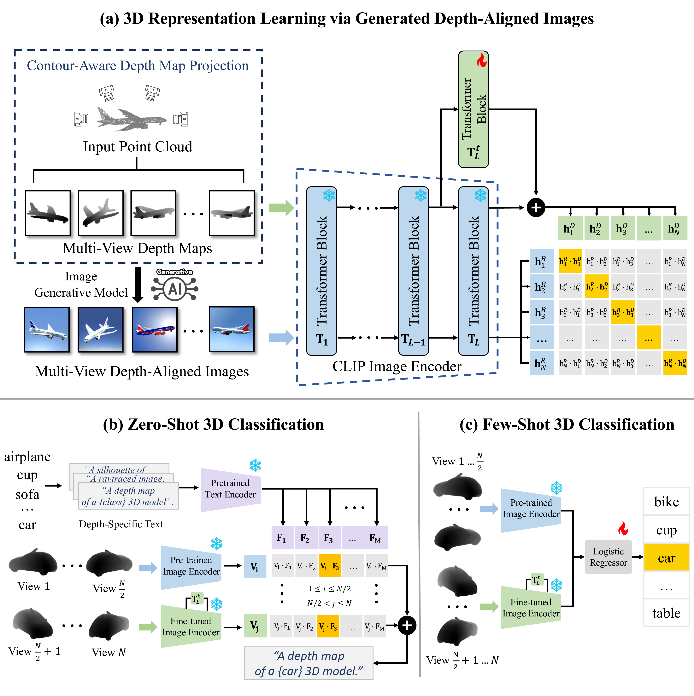

[](https://paperswithcode.com/sota/zero-shot-3d-point-cloud-classification-on-2?p=opendlign-enhancing-open-world-3d-learning)
[](https://paperswithcode.com/sota/zero-shot-3d-point-cloud-classification-on-6?p=opendlign-enhancing-open-world-3d-learning)
[](https://paperswithcode.com/sota/zero-shot-3d-point-cloud-classification-on-5?p=opendlign-enhancing-open-world-3d-learning)
[](https://paperswithcode.com/sota/zero-shot-3d-point-cloud-classification-on-4?p=opendlign-enhancing-open-world-3d-learning)
[](https://paperswithcode.com/sota/zero-shot-transfer-3d-point-cloud-2?p=opendlign-enhancing-open-world-3d-learning)
[](https://paperswithcode.com/sota/zero-shot-transfer-3d-point-cloud?p=opendlign-enhancing-open-world-3d-learning)


# [NeurIPS 2024] OpenDlign: Enhancing Open-World 3D Learning with Depth-Aligned Images.

**[Imperial College London](https://www.imperial.ac.uk/)**

[Ye Mao](https://yebulabula.github.io/), [Junpeng Jing](https://tomtomtommi.github.io/), [Krystian Mikolajczyk](https://www.imperial.ac.uk/people/k.mikolajczyk)

[[`Paper`](https://arxiv.org/abs/2404.16538)] [[`Project Website`](https://Yebulabula.github.io/OpenDlign/)]


[***News***] [23/06/2024] OpenDlign pre-trained models and datasets have been released. 🔥🔥🔥

[***News***] [25/04/2024] The OpenDlign paper is released on Arxiv. 🔥🔥🔥

Official implementation of [OpenDlign: Enhancing Open-World 3D Learning with Depth-Aligned Images](https://arxiv.org/abs/2404.16538)


**Top:** Comparison of OpenDlign with traditional open-world 3D learning models. Depth-based (a) and point-based (b) methods employ additional depth or point encoders for pre-training to align with CAD-rendered images. Conversely, OpenDlign (c) fine-tunes only the image encoder, aligning with vividly colored and textured depth-aligned images for enhanced 3D representation.  **Bottom:** Visual comparison between multi-view CAD-rendered and corresponding depth-aligned images in OpenDlign.


**Overview of OpenDlign.** OpenDlign converts point clouds into multi-view depth maps using a contour-aware projection, which then helps generate depth-aligned RGB images with diverse textures, geometrically and semantically aligned with the maps. A transformer block, residually connected to the CLIP image encoder, is fine-tuned to align depth maps with depth-aligned images for robust 3D representation. 

## Project Summary
OpenDlign is a multimodal framework for learning open-world 3D representations. It leverages depth-aligned images generated from point cloud-projected depth maps. Unlike CAD-rendered images, our generated images provide rich, realistic color and texture diversity while preserving geometric and semantic consistency with the depth maps. Our experiments demonstrate OpenDlign's superior performance in zero-shot and few-shot classification, 3D object detection, and cross-modal retrieval, especially with real-scanned 3D objects.

## Install environments
We pre-train OpenDlign on 1 Nvidia A100 GPU, the code is tested with CUDA==11.3 and pytorch==1.11.0
```
conda create -n OpenDlign python=3.8
conda activate OpenDlign
conda install pytorch==1.11.0 torchvision==0.12.0 torchaudio==0.11.0 cudatoolkit=11.3 -c pytorch
pip install -r requirements.txt
```

## Datasets
The processed evaluation data (i.e., ModelNet40, ScanObjectNN, OmniObject3D) can be found [here](https://huggingface.co/datasets/OpenDlign/OpenDlign-Datasets)

## Pretrained Models
The pre-trained OpenDlign models, which are integrated with various CLIP variants (e.g., ViT-H-14, ViT-L-14, ViT-B-16, ViT-B-32), are available [here](https://huggingface.co/OpenDlign/OpenDlign-Models)

## Inference
Update the root path of your downloaded evaluation dataset before running the following command:

```bash scripts/zero_shot.sh```

## Training
Update the root path of your downloaded training dataset before running the following command:

```bash scripts/model_training.sh```

## Citation

If you find our code is helpful, please cite our paper:

```
@article{mao2024opendlign,
  title={OpenDlign: Enhancing Open-World 3D Learning with Depth-Aligned Images},
  author={Mao, Ye and Jing, Junpeng and Mikolajczyk, Krystian},
  journal={arXiv preprint arXiv:2404.16538},
  year={2024}
}
